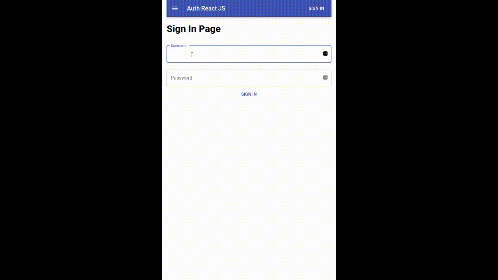

# About
This project was bootstrapped with [Create React App](https://github.com/facebook/create-react-app).
## React JS Auth (pt_BR)
Autenticação de rotas em React JS e utilizando Material UI com simulação de servidor.

## React JS Auth (EN)
A simple authentication flow with React JS and Material UI, Without server communication, only simulation.

## Available Scripts

In the project directory, you can run:

### `yarn start`

Runs the app in the development mode. 
Open [http://localhost:3000](http://localhost:3000) to view it in the browser.

The page will reload if you make edits. 
You will also see any lint errors in the console.

## Learn More

You can learn more in the [Create React App documentation](https://facebook.github.io/create-react-app/docs/getting-started).

To learn React, check out the [React documentation](https://reactjs.org/).

